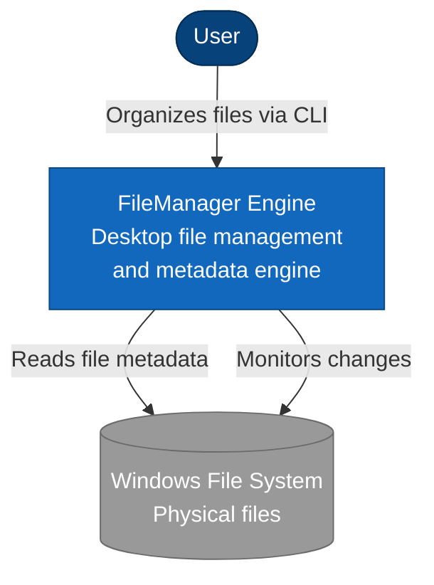

# C1 - System Context Diagram

## Purpose
Shows how FileManager Engine fits into the user's environment and interacts with external systems.

## Diagram

## Elements

### User
Desktop user who wants to organize their local files without changing physical file locations.

### FileManager Engine
Desktop file management engine that provides:
- Virtual folder organization
- Tag and metadata management
- Duplicate detection
- Smart collections
- File change monitoring

### Windows File System
The native file system where physical files reside.
FileManager reads metadata and monitors changes but never owns or relocates physical files.

## Key Principles
- Physical file system is the source of truth for physical files
- FileManager database is the source of truth for logical organization and metadata
- FileManager never owns physical files, only indexes them
