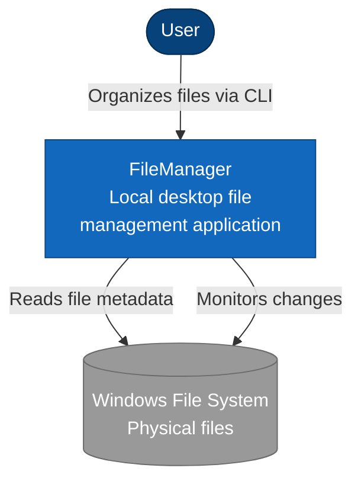

# C1 - System Context Diagram

## Purpose
Shows how FileManager fits into the user's environment and interacts with external systems.

## Diagram

## Elements

### User
Desktop user who wants to organize their local files without changing physical file locations.

### FileManager
Local desktop file management application that provides:
- Virtual folder organization
- Collections and albums
- Tag and metadata management
- Timeline-based browsing
- Duplicate detection
- Thumbnail generation
- Future AI enrichment

### Windows File System
The native filesystem where physical files reside.
FileManager reads file metadata and monitors changes but never modifies, moves, renames, or
deletes any physical file.

## Key Principles
- The physical filesystem is the source of truth for physical files
- The Metadata Store is the source of truth for logical organization and application metadata
- FileManager never modifies physical files — it indexes and organizes them virtually
