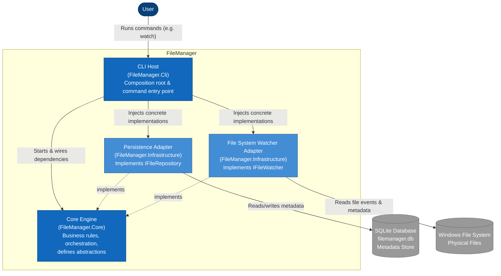

# C2 - Container Diagram

## Purpose
Shows the high-level building blocks of FileManager and how they collaborate to keep a persistent
Metadata Store synchronized with the physical filesystem.

FileManager is a **local desktop file management application**. The internal components
described here are the engine that powers it — not the product identity itself.
Search, if introduced later, would be one additional consumer of the Metadata Store — not a
core container.

## Diagram (Current Implementation)

> Dashed arrows (`-.->`) represent **dependency inversion**: Infrastructure adapters implement abstractions owned by Core. Core has no outgoing dependency on Infrastructure.

## Containers

### CLI Host (FileManager.Cli)
**Technology:** .NET 9 Console Application

**Responsibilities:**
- Composition root: constructs and wires concrete Infrastructure implementations into Core abstractions
- Command routing (e.g., `watch`)

**Rules:**
- No business logic
- Only depends on Core abstractions and Infrastructure implementations for wiring

### Core Engine (FileManager.Core)
**Technology:** .NET 9 Class Library

**Responsibilities:**
- Business entities (`FileEntry`)
- Orchestration services (`IndexingService`, `FileChangeWorker`, `FileHasher`, `DuplicateDetector`)
- Abstractions consumed by the engine (`IFileRepository`, `IFileWatcher`, `IFileScanner`, `IFileIndexer`)
- Domain events (`FileChangeEvent`, `FileChangeQueue`)

**Rules:**
- Has zero dependency on Infrastructure
- Depends only on its own abstractions
- Contains all business/orchestration logic

### Persistence Adapter (FileManager.Infrastructure)
**Technology:** .NET 9 / EF Core

**Responsibilities:**
- Implements `IFileRepository`
- Persists and retrieves file metadata (`FileManagerDbContext`, `FileRepository`)

### File System Watcher Adapter (FileManager.Infrastructure)
**Technology:** .NET 9 / `System.IO.FileSystemWatcher`

**Responsibilities:**
- Implements `IFileWatcher`
- Detects filesystem changes and forwards them to Core (`LocalFileWatcher`)

### SQLite Database
**Responsibilities:**
- Persistent Metadata Store
- Source of truth for logical organization and application metadata

### Windows File System
**Responsibilities:**
- Physical file storage
- Source of truth for physical files
- Read-only from the application's perspective — no flow in this diagram writes to it

