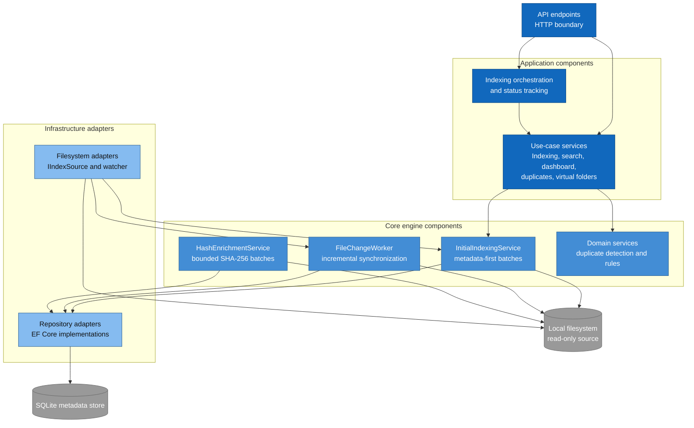

# C3 - Component Diagram

## Purpose

Shows the major components inside the FileManager backend and how the API, Application, Core, and
Infrastructure layers collaborate. The diagram focuses on implemented product capabilities and the
indexing engine that supports them.

## Diagram

## Components

### API endpoints

The Minimal API exposes dashboard, search, duplicate, indexed-location, indexing-status, and virtual
folder operations. It depends on Application contracts and hosts the background hash worker.

### Use-case services

Application services form the boundary consumed by the API and CLI. They orchestrate Core behavior,
map domain objects to DTOs, and keep persistence and filesystem details out of presentation code.

### Indexing orchestration and status

`IndexingOrchestrationAppService` starts an initial scan in a scoped background task.
`IndexStatusService` exposes its current state and processed-file count to the API.

### InitialIndexingService

Enumerates paths through `IIndexSource`, loads existing entries for each 500-path batch, creates
metadata-only entries, and persists them with a single batch upsert. New or modified files are stored
with an empty hash so the initial scan remains responsive.

### FileChangeWorker

Consumes filesystem change events and delegates create, update, rename, and delete synchronization to
`IndexingService`. Failures are isolated so one inaccessible file does not stop the worker loop.

### HashEnrichmentService

Selects files whose hash is missing, computes SHA-256 in bounded batches of 100, and persists completed
hashes. Because the pending work is derived from durable SQLite state, unfinished enrichment resumes
naturally after process restart.

### Repository adapters

EF Core repositories implement Core-owned contracts for files, indexed roots, virtual folders, and
many-to-many virtual-folder membership.

## Architectural Boundaries

- Core owns business rules and contracts; it has no dependency on Infrastructure.
- Application exposes use cases and DTOs; front ends do not access EF Core directly.
- Infrastructure implements persistence and filesystem adapters.
- The local filesystem is read-only to all indexing and enrichment components.
- SQLite stores metadata and virtual organization, never copies of source files.

## Related Diagrams

- [C1 - System Context](C1-CONTEXT.md)
- [C2 - Containers](C2-CONTAINER.md)
- [C4 - Indexing and hash-enrichment code](C4-INDEXING-CODE.md)
