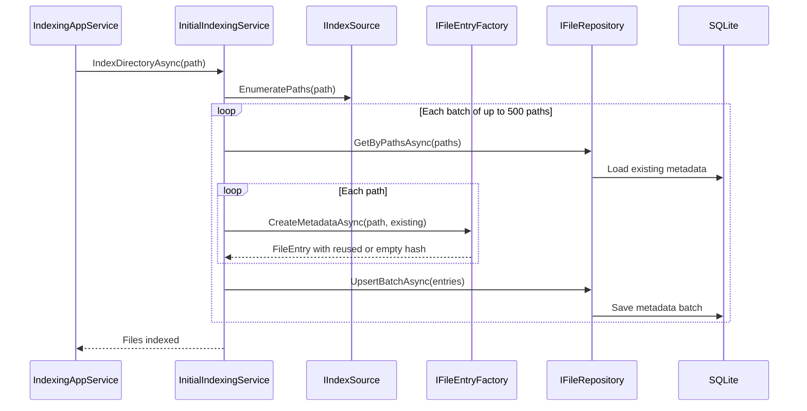
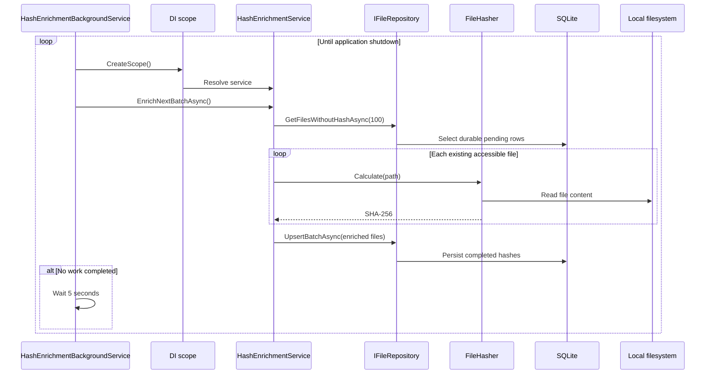

# C4 - Indexing and Hash-Enrichment Code Diagram

## Purpose

Provides a focused code-level view of the metadata-first indexing pipeline and resumable background
hash enrichment. It intentionally covers only this performance-critical flow; documenting every class
would add noise and become stale quickly.

## Initial Metadata Indexing

### Hash decision during the initial scan

| File state | Stored hash |
|---|---|
| Existing file with unchanged size and modified timestamp | Reuse the existing hash |
| New file | Empty |
| Existing file whose metadata changed | Empty |
| Missing or inaccessible file | Skip or create a missing metadata entry according to the factory path |

The initial scan does not read file contents for new or changed files. This keeps discovery fast and
makes useful metadata available before expensive hashing finishes.

## Resumable Background Hashing

## Why It Resumes After Restart

There is no transient in-memory queue that owns the pending work. A file is pending precisely when its
durable database row has an empty hash. Each worker iteration queries that state again in deterministic
path order and takes at most 100 rows.

If the process stops:

- hashes saved by completed batch upserts remain complete;
- rows whose hashes were not persisted remain empty;
- the next process start queries those empty rows and continues;
- no source file is modified during recovery or normal processing.

This is database-driven resumption rather than a separate checkpoint mechanism.

## Key Types

| Type | Responsibility |
|---|---|
| `IndexingOrchestrationAppService` | Starts initial indexing outside the request and reports progress |
| `InitialIndexingService` | Coordinates path enumeration and 500-entry metadata batches |
| `IIndexSource` | Supplies paths without coupling indexing logic to a discovery implementation |
| `IFileEntryFactory` / `FileEntryFactory` | Builds metadata entries and decides whether an existing hash is reusable |
| `HashEnrichmentBackgroundService` | Hosts the repeating scoped background loop |
| `HashEnrichmentService` | Hashes the next bounded batch of pending files |
| `FileHasher` | Reads file content and calculates SHA-256 |
| `IFileRepository` / `FileRepository` | Queries pending rows and persists batches through EF Core |
| `FileManagerDbContext` | Maps durable metadata to SQLite |

## Failure and Cancellation Behavior

- Cancellation is checked during enumeration, batch processing, and hash enrichment.
- Missing files are skipped by the hash service.
- I/O and access errors are isolated per file.
- Unexpected background-loop failures are logged, followed by a five-second retry delay.
- A failed or interrupted file retains an empty hash and is therefore eligible for a later attempt.

## Safety Invariant

All arrows toward the local filesystem are reads. Initial indexing reads metadata; hashing reads file
content. Every write goes only to FileManager's SQLite metadata database.

## Related Diagrams

- [C1 - System Context](C1-CONTEXT.md)
- [C2 - Containers](C2-CONTAINER.md)
- [C3 - Components](C3-COMPONENTS.md)
