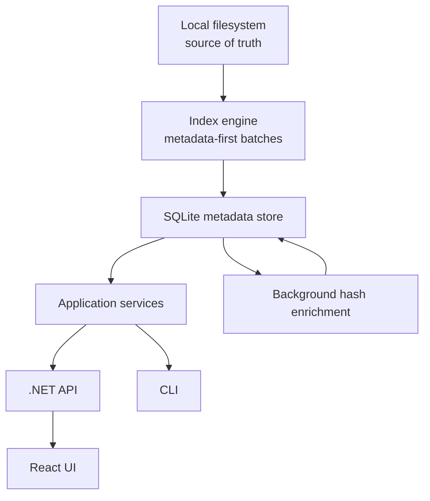

# FileManager

<p align="center">
  <strong>A local-first file library that helps you organize and rediscover files without changing where they live.</strong>
</p>

<p align="center">
  <a href="https://file-manager-app.base44.app">Live UI Demo</a>
  ·
  <a href="Docs/PRD.md">Product Vision</a>
  ·
  <a href="Docs/ARCHITECTURE.md">Architecture</a>
  ·
  <a href="Docs/ROADMAP.md">Roadmap</a>
</p>

<p align="center">
  
  
  
  
</p>

> [!NOTE]
> FileManager is under active development. The live demo presents the product experience; the local .NET engine and API are the source of truth for indexing and file metadata.

## Why FileManager?

Files rarely belong in only one place. A photo can be part of a family album, a trip, and a yearly archive—but a physical folder tree forces it into a single location.

FileManager adds a virtual organization layer above the existing filesystem:

- one physical file can appear in multiple virtual folders;
- users can browse and organize content without moving or duplicating it;
- local metadata enables fast discovery, timeline views, and duplicate reports;
- the filesystem remains the source of truth.

The application owns metadata and virtual organization only. Background indexing, hashing, duplicate detection, and future AI enrichment are read-only operations on source files.

## Product Preview

Explore the current UI concept in the [live demo](https://file-manager-app.base44.app).

The experience is designed around an Explorer-style workspace with nested virtual folders, file browsing, search, duplicate insights, indexing status, and per-file metadata.

<!-- Add a repository-owned screenshot here when the integrated UI is ready:

-->

## Current Capabilities

| Area | Available today |
|---|---|
| Indexing | Metadata-first directory indexing with batched persistence |
| Background processing | Resumable SHA-256 enrichment for files whose hashes are still missing |
| Change tracking | Create, update, rename, and delete events reflected in the local index |
| Organization | Nested virtual folders and many-to-many file associations |
| Discovery | Metadata search by name, extension, path, and modified date |
| Duplicate insights | Hash-based duplicate grouping and potential storage savings |
| Operations | Indexed-location management and live indexing status |
| Interfaces | .NET API, CLI, and a React product UI in active integration |
| Persistence | Local SQLite metadata database |

## Safety by Design

FileManager is built around strict ownership boundaries:

- it never deletes, moves, renames, or overwrites a physical file automatically;
- the filesystem—not the application database—is the source of truth;
- virtual folders, collections, tags, and generated metadata live only in the local database;
- any future operation that changes a physical file must be explicit, user-initiated, and confirmed.

These rules are architectural constraints, not UI conventions. See the [PRD](Docs/PRD.md#non-negotiable-principles) for the complete specification.

## How It Works



The initial scan records inexpensive filesystem metadata first. Content hashing is handled separately in bounded background batches, so indexing can become useful quickly and unfinished enrichment can continue after a restart.

The indexing source is behind an `IIndexSource` abstraction, keeping the pipeline open to faster platform-specific strategies such as an NTFS MFT reader without coupling business logic to the filesystem implementation.

## Architecture

```text
FileManager.Core             Domain entities, contracts, and business rules
FileManager.Application      Use cases, orchestration, and DTO boundaries
FileManager.Infrastructure   SQLite, repositories, filesystem adapters, workers
FileManager.Api              HTTP endpoints and background-service host
FileManager.Cli              Command-line interface and composition root
client/file-manager-app      React/Vite product interface
tests                        Unit, infrastructure, application, and integration tests
Docs                         PRD, architecture, ADRs, C4 diagrams, and roadmap
```

Core and Application remain independent from EF Core, SQLite, and presentation concerns. Front ends consume use cases through Application services rather than accessing persistence directly.

For deeper technical context, see:

- [Architecture](Docs/ARCHITECTURE.md)
- [Index engine](Docs/INDEX_ENGINE.md)
- [Data flow](Docs/DATA_FLOW.md)
- [Domain model](Docs/DOMAIN_MODEL.md)
- [Performance strategy](Docs/PERFORMANCE.md)
- [C4 model: C1 context](Docs/c4/C1-CONTEXT.md), [C2 containers](Docs/c4/C2-CONTAINER.md), [C3 components](Docs/c4/C3-COMPONENTS.md), and [C4 indexing code](Docs/c4/C4-INDEXING-CODE.md)
- [Architecture decision records](Docs/ADR/)

## Technology

- **Backend:** C# 13, .NET 9, ASP.NET Core Minimal API
- **Persistence:** Entity Framework Core 9 and SQLite
- **Frontend:** React 18, Vite, TanStack Query, Tailwind CSS, Radix UI
- **Testing:** xUnit, FluentAssertions, Moq, and real SQLite integration tests
- **Architecture:** Clean layering, dependency injection, repository and adapter boundaries

## Run Locally

### Prerequisites

- [.NET 9 SDK](https://dotnet.microsoft.com/download/dotnet/9.0)
- [Node.js](https://nodejs.org/) with npm, for the React client
- Git

### 1. Clone and restore

```bash
git clone https://github.com/tamar-dev/FileManager.git
cd FileManager
git switch feature/indexing-performance
dotnet restore FileManager.Engine.sln
```

### 2. Build and test

```bash
dotnet build FileManager.Engine.sln
dotnet test FileManager.Engine.sln
```

The automated suite covers Core business rules, Application orchestration, real SQLite repositories, initial indexing, and filesystem-watcher flows.

### 3. Start the API

```bash
dotnet run --project FileManager.Api
```

The development API starts at `http://localhost:5093` by default. Database migrations are applied automatically on startup.

Useful endpoints include:

- `GET /api/health`
- `GET /api/dashboard`
- `GET /api/files/search`
- `GET /api/duplicates`
- `GET /api/indexed-locations`
- `POST /api/index`
- `GET /api/index/status`
- `GET /api/virtual-folders`

### 4. Start the React client

```bash
cd client/file-manager-app
npm install
npm run dev
```

Open the local URL printed by Vite. The client is currently being integrated with the local .NET API, so some screens may still use prototype data or hosted services.

## CLI

The engine can also be exercised directly:

```bash
dotnet run --project FileManager.Cli -- index "C:\\Users\\you\\Pictures"
dotnet run --project FileManager.Cli -- watch "C:\\Users\\you\\Pictures"
dotnet run --project FileManager.Cli -- dashboard
dotnet run --project FileManager.Cli -- duplicates
```

## Roadmap

Near-term work focuses on completing the end-to-end desktop experience:

- finish React-to-.NET API integration;
- expose complete indexing progress, pause, and stop controls;
- add timeline browsing and richer photo metadata;
- generate and cache thumbnails in the background;
- expand collections, albums, and smart organization;
- add optional AI enrichment such as OCR and semantic discovery.

AI will enrich metadata only. It will not replace user control or modify source files.

See the full [roadmap](Docs/ROADMAP.md).

## Project Status

This repository currently demonstrates the product architecture and a substantial working engine, but it is not yet packaged as an end-user desktop release. The next milestone is a cohesive local application that connects the React interface to the .NET API and exposes the implemented engine through a polished workflow.

## Author

Created by [Tamar Sharabi](https://github.com/tamar-dev).
